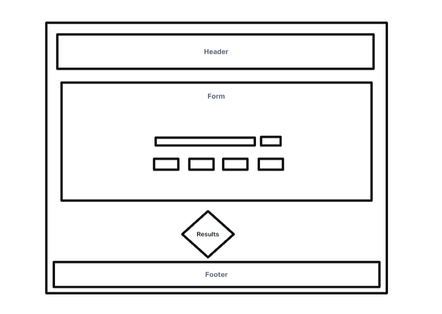
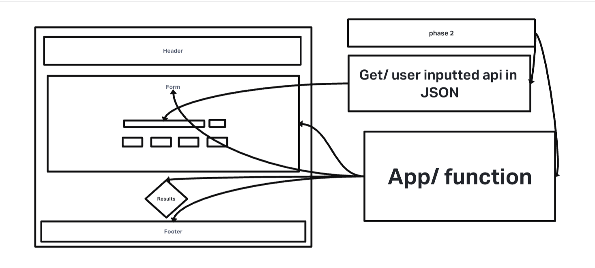

# RESTy

## Author: Luis Rosales

A browser based API testing tool

## Credits

Starter Code, Tyler Main

## Business Requirements

Our application will be an API testing tool that can be run in any browser, allowing a user to easily interact with APIs in a familiar interface.

## Problem Domain

Today, we begin the first of a 4-Phase build of the RESTy application, written in React. In this first phase, our goal is to setup the basic scaffolding of the application, with intent being to add more functionality to the system as we go. This initial build sets up the file structure so that we can progressively build this application in a scalable manner.

## UML

## Phase 1 UML

## Phase 1

[Phase 1 URL](https://codesandbox.io/p/github/RosalesJr/resty/lab26?file=%2FREADME.md&workspace=%257B%2522activeFileId%2522%253A%2522cl9niyv5u0002lrigbcn72avx%2522%252C%2522openFiles%2522%253A%255B%255D%252C%2522sidebarPanel%2522%253A%2522EXPLORER%2522%252C%2522gitSidebarPanel%2522%253A%2522COMMIT%2522%252C%2522sidekickItems%2522%253A%255B%257B%2522type%2522%253A%2522PREVIEW%2522%252C%2522taskId%2522%253A%2522start%2522%252C%2522port%2522%253A3000%252C%2522key%2522%253A%2522cl9njaj3l007s356h3yzxjjhq%2522%252C%2522isMinimized%2522%253Afalse%257D%255D%257D)

- Convert all child components of App.js from classes to functions
- The App component serves as the container for all sub-components of this application.
- Leave this component as a Class.
- Make sure all base styles for App are included in a .scss imported within App.js.
- Ensure that the Header, Footer, Results and Form components are imported using ES6 import syntax.
- Use .scss files to style each component
- Each of the components use their own .scss file for styling.
- Core application functionality should remain unchanged:
- The Form component should:
- Call a function on submit that updates the App component via a function sent down as a prop so that the app can process the form values.
- The Results component should show mock API results.

## Phase 2 Lab27

## URL

[Url](https://codesandbox.io/p/github/RosalesJr/resty/phase2?file=%2FREADME.md&workspace=%257B%2522activeFileId%2522%253A%2522cl9niyv5u0002lrigbcn72avx%2522%252C%2522openFiles%2522%253A%255B%255D%252C%2522sidebarPanel%2522%253A%2522EXPLORER%2522%252C%2522gitSidebarPanel%2522%253A%2522COMMIT%2522%252C%2522sidekickItems%2522%253A%255B%257B%2522key%2522%253A%2522cl9p65eef004i356iyigib1ow%2522%252C%2522type%2522%253A%2522PROJECT_SETUP%2522%252C%2522isMinimized%2522%253Afalse%257D%252C%257B%2522type%2522%253A%2522PREVIEW%2522%252C%2522taskId%2522%253A%2522start%2522%252C%2522port%2522%253A3000%252C%2522key%2522%253A%2522cl9p65gv7008y356i638jnstj%2522%252C%2522isMinimized%2522%253Afalse%257D%255D%257D)

## Credits/ Collab

Taylor, Stephanie, Stephen, Demo Code

## Phase 2 UML 

In phase 2, we will be receiving user input in preparation of connecting to live APIs, using the useState() hook in our functional components. In order to properly manage state with the useState hook, we will now convert App.js to a functional component.

The following user stories detail the major functionality for this phase of the project.

- As a user, I want to enter the REST Method and URL to an API
- As a user, I want to see a summary of my request as well as results returned from an API request in my browser in a readable format
- Application Flow:

- User enters an API URL
- Chooses a REST Method
- Clicks the “Go” button
- Application fetches data from the URL given, with the method specified
- Displays the response headers and results separately
- Both headers and results displayed “pretty printed” JSON

## Phase 3 Lab28

## Lab28 UML

## Credits % Collab

Taylor, Stephanie, Brandon, Demo Code

## Lab 28 URL

[Lab28 URL](https://codesandbox.io/p/github/RosalesJr/resty/phase3?file=%2FREADME.md&workspace=%257B%2522activeFileId%2522%253A%2522cl9niyv5u0002lrigbcn72avx%2522%252C%2522openFiles%2522%253A%255B%255D%252C%2522sidebarPanel%2522%253A%2522EXPLORER%2522%252C%2522gitSidebarPanel%2522%253A%2522COMMIT%2522%252C%2522sidekickItems%2522%253A%255B%257B%2522type%2522%253A%2522PREVIEW%2522%252C%2522taskId%2522%253A%2522start%2522%252C%2522port%2522%253A3000%252C%2522key%2522%253A%2522cl9q8ve55004j356ix5vycfub%2522%252C%2522isMinimized%2522%253Afalse%257D%255D%257D)

In phase 3, we will be connecting RESTy to live APIs, fetching and displaying remote data. Our primary focus will be to service GET requests

The following user stories detail the major functionality for this phase of the project.

As a user, I want to enter the URL to an API and issue a GET request so that I can retrieve it’s data
As a user, I want to see the results returned from an API request in my browser in a readable format
Application Flow:

User enters an API URL
Chooses a REST Method
Clicks the “Go” button
Application fetches data from the URL given, with the method specified
Displays the response headers and results separately
Both headers and results should be “pretty printed” JSON